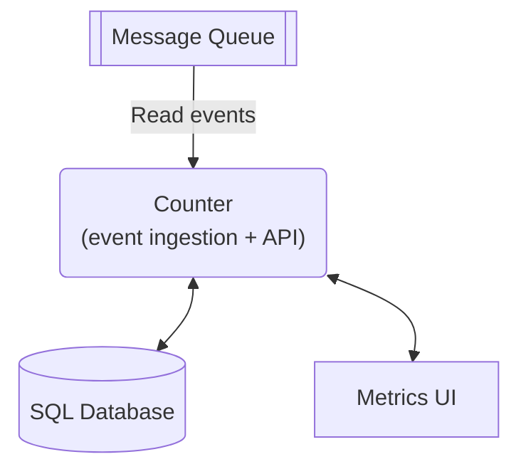

# Counter Service Data Backend Scalability

## Authors

[Vicente Olmedo](https://github.com/volmedo)

## Abstract

This document presents the Counter service and the current scalability issues of its data backend. The service’s database is in a delicate state and this is resulting in significant impact to customers as well as internal teams.

After the issue is described, different alternative measures are shown and a potential plan to mitigate its impact is proposed.

## Introduction

Counter is an event ingestion service. As such, it reads events published by other services and stores relevant metadata about them in a database. This metadata can then be queried to present the user with helpful graphical representations in the metrics analytics UI.

Counter was implemented long ago with the main goal of being flexible enough to count any kind of events, without a specific use case in mind. Back when the team designed the service, it was decided to use an SQL database as the data backend for the service, mainly because most other services in the company use relational databases and there is a data infrastructure operations team in charge of large SQL on prem database clusters.

## The problem

The team that designed Counter was disbanded and the service has been running in production for some time now without supervision or maintenance. Without clear ownership, no new features have been added and the original logic has not been adapted to new requirements.

The most pressing issue with Counter is that the service has maxed out the single table it uses to store event metadata to the point that the file where the data lives is about to reach the maximum size supported by the underlying filesystem (16 TiB). This situation impacts several stakeholders, both internal and external, in different ways:

- Customers are affected due to missing data points and increased latency, with some queries taking unreasonable time to complete.

- Internally, the service is also posing a range of operational issues for the data infrastructure team, who struggle to keep its database up.

- It is difficult for the engineering team now owning the service to maintain it adequately or implement new features because of the delicate situation. Given the rate of events being ingested and the poor performance of the database, even deploying new versions causes spikes in queued messages, with a high risk of aggravating the issue and causing downtime.

- Because of this, Product cannot add or change features, hindering the company’s capacity to deliver value to customers.

Given the impact on customers and the operational implications, measures to solve the issue, or at least mitigate its effects, need to be implemented quickly.

## Out of scope

- Backfill any data that may have been lost during previous incidents.
- Make any changes to the database infrastructure itself.

## Potential solutions

While the problem is of deep technical nature, it is usually worth approaching this kind of issues from a product angle. On many occasions the best solution is not a purely technical one.

This section describes some alternatives that could be considered when looking for a solution.

### Review and adjust product functionality

As a first step, the Product team should be consulted and usage metrics should be analyzed. This exercise will provide useful inputs to guide the selection of potential measures. Besides, it may reveal solutions that properly address the implications of the issue while limiting the implementation effort.

As such, removing functionality that doesn’t add value to the user could be considered. This approach can be taken to the extreme. Decommissioning the service shouldn’t be ruled out from the get-go.

#### Tradeoffs

- ✅ Low implementation effort.
- ❌ Removing specific functionality without impacting others can be challenging.
- ❌ Estimating the impact to customer trust of shutting the product off is not straightforward.

### Squeeze as much juice out of the current SQL DB as possible

Since the root of the problem is available capacity in the SQL DB cluster, exploration should be done to ensure that capacity is being used in the most efficient way. Some measures that could improve the situation from this standpoint are as follows:

- **Improve record reaping**: there is already a scheduled task within the service in charge of removing records that are too old to be useful anymore. The schedule can be tightened for increased space savings, at the cost of impacting query performance.

- **Increase aggregation aggressiveness**: understanding how the product works and how it is used by our users is key to ensure only the strictly necessary data is stored. Implementing a more aggressive aggregation would imply a loss of resolution but would improve space utilization. Making the aggregation period a function of the record’s age could be a good balance between both dimensions.

- **Implement data partitioning**: the hard limit being hit is imposed by the filesystem and stems from the fact that a single table is used to store all data. A common way to improve performance of large tables is data partitioning. Unfortunately, the DB version is old enough and does not support that natively. The data infrastructure team has already stated that updating the cluster to a new version is not feasible. However, implementing data partitioning on the service’s side can still be considered. The implementation of such a mechanism would likely require dealing with non-obvious challenges and would impose a performance penalty, but the greater elasticity could be worth the cost.

#### Tradeoffs

- ✅ Medium implementation effort, might be a quick way of buying time.
- ❌ Varying degrees of impact in performance.
- ❌ Not a long term solution.

### Migrate to a more scalable data backend

The current DB technology used by the service along with the fact that it is deployed on the company’s own datacenter makes it very difficult to scale the database in a flexible way. Besides, a careful analysis of the service’s data access patterns reveals that a NoSQL DB would be a great fit as a data backend. A key characteristic of these DBs is their capacity to scale horizontally, making it easier to adapt it to workloads that evolve over time.

#### Tradeoffs

- ❌ High implementation effort. There is no previous experience in the company of a product utilizing one of such DBs.
- ✅ Better resource utilization thanks to the DB’s ability to scale to adapt to different workloads.
- ✅ Reduced operational burden, even more if a serverless offering is considered.
- ✅ Increased performance.
- ✅ Improved engineering capacity to maintain the service and add new features.
- ✅ Long term solution.

## Proposed path forward

Taking into account the alternatives above, the proposed plan would be as follows:

1. Confirm with Product which measures could make sense from a product perspective. It is unlikely discontinuing the product is a valid alternative, but their insights will be useful to decide what the next steps should be.

1. In parallel, work on improving observability, as it is also essential to choose the best course of action.

1. Implement data partitioning to stop adding data to the current table. This should prevent further data loss and reduce the number of pages to the data infrastructure team.

1. If that is not enough, consider additional measures depending on what the metrics look like.

1. Estimate the effort of implementing support for a new data backend in the service and evaluate the cost/benefit ratio.

Essentially, the strategy consists in reducing the urgency of the issue and then re-evaluate the impact of the different alternatives from a longer term perspective.
